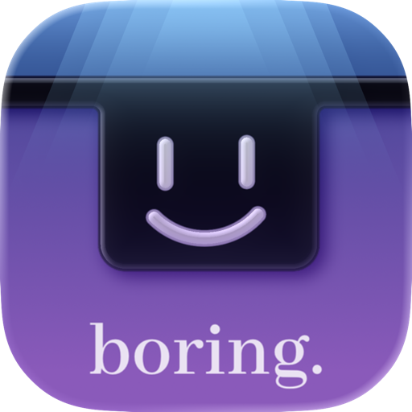

<h1 align="center">QuartzNotch</h1>

<p align="center">
  
</p>

QuartzNotch is a fork of BoringNotch focused on smoother interactions, richer live activities, and a more compact, adaptive notch experience.

## Changelog

- Made the notch more compact, with dynamic width that adapts to displayed content.
- Introduced a new page navigation system that is smoother and more intuitive.
- Added a new toolbar capsule for quick access to key features and actions.
- Added a new animated lock screen live activity.
- Merged music providers so no manual provider selection is needed anymore.
- Added a shelf live activity showing how many files are currently in the shelf.
- Added a new track-skipping animation inspired by iOS Dynamic Island behavior.
- Slightly refined the notch shape.
- Updated default options for a better out-of-the-box experience.
- Revamped the charging live activity.
- Added a dedicated Live Activities category in Settings.
- Added an expandable Bluetooth devices live activity.
- Improved the Settings experience overall.
- Added a third page with quick timers and a clipboard manager.
- Added a live activity timer.
- Added support for displaying two live activities at the same time.
- Overhauled and improved animations across the app.

## Installation

System requirements:
- macOS 14 or later
- Apple Silicon or Intel Mac

> [!IMPORTANT]
> This build is unsigned with an Apple Developer certificate.
> On first launch, macOS may block it as an unidentified developer app.
> You can allow it from `System Settings > Privacy & Security > Open Anyway`.

## Build From Source

```bash
git clone <your-repo-url>
cd codex
open boringNotch.xcodeproj
```

Build and run from Xcode (`Cmd + R`).

## License

See `LICENSE`.
