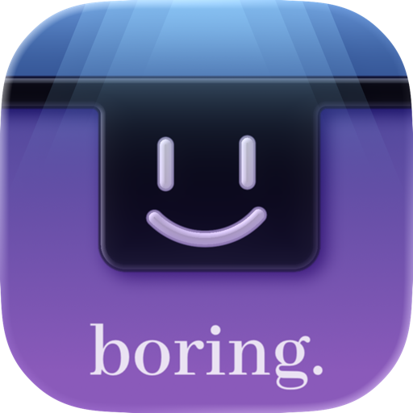
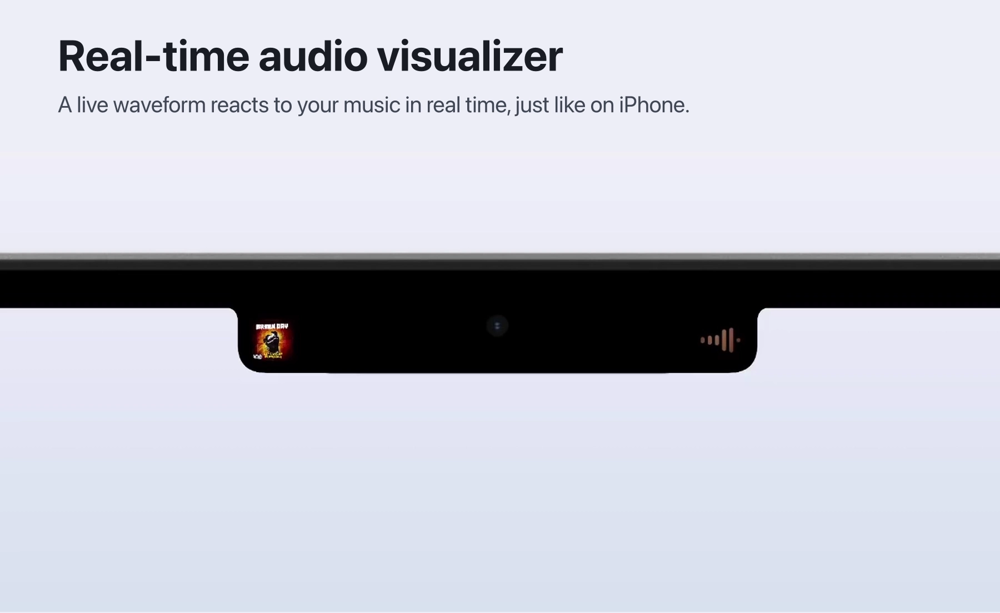
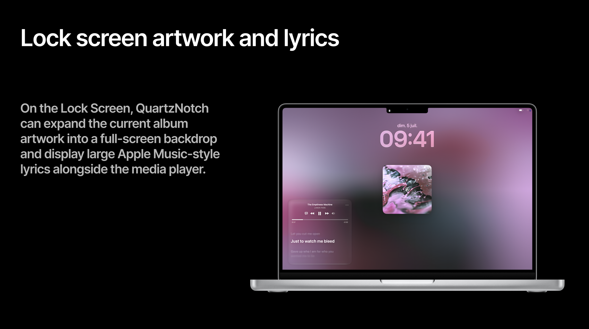

<p align="center">
  
</p>

<h1 align="center" style="font-size: 3em; font-weight: 800; margin-bottom: 0;">QuartzNotch</h1>

<p align="center">
  QuartzNotch is a macOS utility that extends the MacBook notch into a functional control surface. It provides quick access to media playback, calendar events, Live Activities, and essential tools directly from your menu bar.
</p>

<p align="center">
  <a href="https://github.com/Clayton630/QuartzNotch/releases/download/v0.4.1/QuartzNotch-0.4.1.1036.dmg">
    
  </a>
</p>

---

## Make the notch useful

<p>
  <a href="https://github.com/Clayton630/QuartzNotch/releases/latest"></a>
  
  
  <a href="LICENSE"></a>
</p>

QuartzNotch transforms the MacBook notch into a compact command center for the things you check and control all day. It brings your media, calendar, timers, quick tools, Live Activities, and Lock Screen controls into one interface that feels native to the Mac instead of sitting in another window.

<br>

<p align="center"><a href="docs/media/realtime-visualizer.mp4"></a></p>

<p align="center"><a href="docs/media/lock-screen-album-lyrics.png"></a></p>

<table width="100%">
  <tr>
    <td align="center">
      <h3>Media that stays within reach</h3>
      <p>Control playback, scrub through tracks, adjust volume, follow lyrics, hide the source badge when you want a cleaner look, and keep Now Playing visible without opening your music app.</p>
      <br><br>
    </td>
  </tr>
  <tr>
    <td align="center">
      <h3>Lock Screen experiences</h3>
      <p>Show a refined Lock Screen player, fullscreen album artwork, Apple Music-style lyrics, and Live Activities for music and timers directly where they make sense.</p>
      <br><br>
    </td>
  </tr>
  <tr>
    <td align="center">
      <h3>Live Activities for macOS</h3>
      <p>Bring music, timers, Bluetooth, battery, focus, shelf, and media states into the notch with custom animations and a layout designed for quick glances.</p>
      <br><br>
    </td>
  </tr>
  <tr>
    <td align="center">
      <h3>Calendar without opening Calendar</h3>
      <p>Swipe through days, check events and reminders, and keep your schedule visible inside the notch with a redesigned calendar module.</p>
      <br><br>
    </td>
  </tr>
  <tr>
    <td align="center">
      <h3>Tools for small actions</h3>
      <p>Use quick timers, file shelf, quick sharing, clipboard utilities, camera preview, customizable toolbar actions, and reorderable pages from one compact surface.</p>
      <br><br>
    </td>
  </tr>
  <tr>
    <td align="center">
      <h3>Built to feel visual</h3>
      <p>QuartzNotch includes a Liquid Glass-inspired appearance, fallback rendering, adaptive app icons, custom symbols, localization, and refined animations across the app.</p>
      <br><br>
    </td>
  </tr>
</table>

## Build From Source

```bash
git clone https://github.com/Clayton630/QuartzNotch.git
cd QuartzNotch
open QuartzNotch.xcodeproj
```

Then build and run the `QuartzNotch` scheme from Xcode with `Cmd + R`.

You can also build from Terminal:

```bash
xcodebuild \
  -project QuartzNotch.xcodeproj \
  -scheme QuartzNotch \
  -configuration Debug \
  build
```

> [!IMPORTANT]
> Current public builds are not notarized with an Apple Developer ID. On first launch, macOS may block the app as coming from an unidentified developer. If you trust the build, open `System Settings > Privacy & Security` and choose `Open Anyway`.
